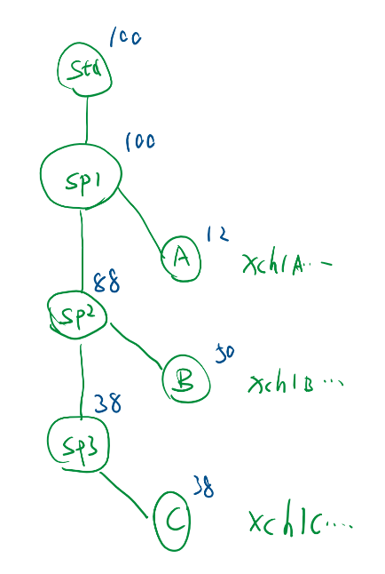

# Popchia

## Introduction

🍿 Popchia, did you get it?

Just like the corn was blasted into many small popcorns, we blasted Chia into a lot of popchia! Everyone can participate in this popchia grabbing game, first come first served, while stocks last！

If you want to make Popchia to share with your friends, you can do this: (In pseudo-UI)

1. Prepare Chia coin (this is the raw material), the exact amount is up to you.
1. Enter the number of people you want to give popchia to.
1. The program will automatically generate a gift package with a password.
1. You can send the password and gift pack to your friends. You can try to send it to the chat group, so that everyone can come and grab it.
1. As a user to grab Popchia, you need to enter your password, open the package, and you will get a random amount of popchia. When all the money has been distributed, the popchia will be “eaten”!
1. Come and try your luck and speed! Whether you're the one who made the popchia or the one who grabbed it, I hope you all have fun!

This game is inspired by the traditional Chinese New Year game: grab red envelopes. Chinese people have the custom of giving out red envelopes during Chinese New Year, which is to seal money into a red envelope. Friends will give each other red envelopes, which means good luck. And the person who grabs the biggest red envelope will be considered the most lucky one!

## Technical Detail



Every Popchia coin is created from a standard coin, everytime a new **SP**ecial coin is created as well as a standard "**T**ake-**A**way" coin until the last time. SP coin is available to next round of "Pop", TA coin is send to participant's wallet.

After first created, SP would check:

1. Next address is also a SP coin.
2. TA coin amount is "randomized" according to coin id of current coin.
3. If according to coin id, remaining amount is insufficient, TA can take all and finish this "pop".


## How to work

```
python3 -m venv venv
. ./venv/bin/activate
pip install chia-dev-tool
python popchia.py
```